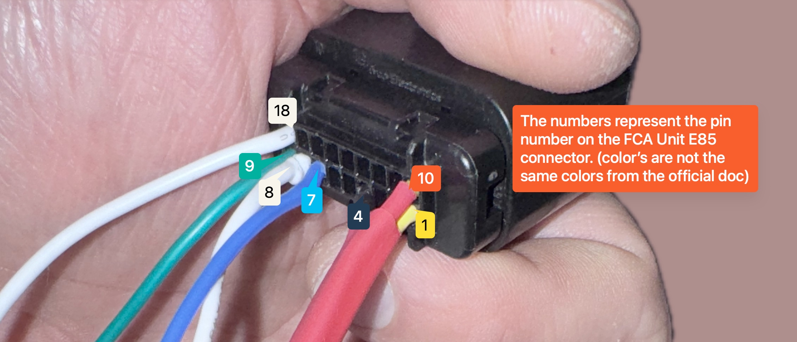

# This document is still a WIP and I used ChatGPT to help me put things down in writing as there's a lot to cover. Feel free to help improve it.

## Introduction
Welcome to the ESCC (Enhanced Smart Cruise Control) IONIQ PHEV Guide. This document provides detailed instructions for connecting and configuring the ESCC Interceptor board with your Hyundai IONIQ Plug-in Hybrid Electric Vehicle (PHEV). Our goal is to simplify the wiring process, enhance vehicle functionality, and ensure a seamless integration with aftermarket components like the Panda device.

## Updated info
On july 28th this guide was updated to rework it's setup and now it uses the relay harness box instead of the custom ESCC board previously mentioned. This simplifies the setup significantly, adds a layer of security with the relay, and makes it even more accessible to use.

## Terminology and Abbreviations
- **ESCC**: Enhanced Smart Cruise Control
- **PANDA**: A universal car interface
- **C-CAN**: Chassis Controller Area Network
- **L-CAN**: Local Controller Area Network
- **IGPM**: Ignition Power Module

## Components

### Harness Female Connector
This connector originates from the car's harness and plugs directly into the radar's male connector.


### Radar's Male Connector
Located on the radar, this is where the car's harness plugs in. The image shows the connector from the front, with securing guides facing upwards.


## Wire Configuration from the Radar Connector and Connections

### Viewing the Car's Harness from Different Angles

#### From the Back


#### Upside Down


#### Tracing Cables and Pins


### Detailed Connection List

```
IONIQ 2203663               Molex 5018762640         IONIQ 2203663
Car Harness (Female)                                 Car Radar (Male)
+-----+-----+               +-----+-----+            +-----+-----+
| 18  |  9  |               |  2  |  1  |            | 10  |  1  |
| 17  |  8  |               |  4  |  3  |            | 11  |  2  |
| 16  |  7  |               |  6  |  5  |            | 12  |  3  |
| 15  |  6  |               |  8  |  7  |            | 13  |  4  |
| 14  |  5  | NOTCH         | 10  |  9  |            | 14  |  5  | NOTCH
| 13  |  4  |               | 12  | 11  |            | 15  |  6  |
| 12  |  3  |               | 14  | 13  | NOTCH      | 16  |  7  |
| 11  |  2  |               | 16  | 15  |            | 17  |  8  |
| 10  |  1  |               | 18  | 17  |            | 18  |  9  |
+-----+-----+               | 20  | 19  |            +-----+-----+
                            | 22  | 21  |
                            | 24  | 23  |
                            | 26  | 25  |
                            +-----+-----+

Connections:
Molex Pin 3 (120 Ohm)    <--> Molex Pin 5  (120 Ohm)
Harness Pin 1  (12V)     <--> Molex Pin 12 (12V)
Harness Pin 4  (GND)     <--> Molex Pin 1  (GND)
Harness Pin 10 (IGN)     <--> Molex Pin 2  (IGN)
Harness Pin 8  (C-CAN H) <--> Molex Pin 4  (C-CAN H)
Harness Pin 7  (C-CAN L) <--> Molex Pin 6  (C-CAN L)
Harness Pin 18 (L-CAN H) <--> Molex Pin 8  (L-CAN H)
Harness Pin 9  (L-CAN L) <--> Molex Pin 10 (L-CAN L)
                              Molex Pin 20 (L-CAN L) <-->  Radar Pin 9  (L-CAN L)
                              Molex Pin 18 (L-CAN H) <-->  Radar Pin 18 (L-CAN H)
                              Molex Pin 24 (C-CAN L) <-->  Radar Pin 7  (C-CAN L)
                              Molex Pin 22 (C-CAN H) <-->  Radar Pin 8  (C-CAN H)
                              Molex Pin 16 (IGN)     <-->  Radar Pin 10 (IGN)
                              Molex Pin 14 (12V)     <-->  Radar Pin 1  (12V)
                              Molex Pin 26 (GND)     <-->  Radar Pin 4  (GND)
```

#### Molex 5018762640 Pinout:

- Pin 1: GND
- Pin 2: IGN
- Pin 3: internal 120 Ohm Resistor, simply bridge to Pin 5
- Pin 4: C-CAN HIGH
- Pin 5: internal 120 Ohm Resistor, simply bridge to Pin 3
- Pin 6: C-CAN LOW
- Pin 8: L-CAN HIGH (***OPTIONAL, IF EQUIPPED***)
- Pin 10: L-CAN LOW (***OPTIONAL, IF EQUIPPED***)
- Pin 12: 12v
- Pin 14: 12v
- Pin 16: IGN
- Pin 18: L-CAN HIGH (***OPTIONAL, IF EQUIPPED***)
- Pin 20: L-CAN LOW (***OPTIONAL, IF EQUIPPED***)
- Pin 22: C-CAN HIGH
- Pin 24: C-CAN LOW
- Pin 26: GND

#### IONIQ 2203663 (Car Harness, Female):

- Pin 1: 12v -> Molex Pin 12
- Pin 4: GND -> Molex Pin 1
- Pin 7: C-CAN LOW -> Molex Pin 6
- Pin 8: C-CAN HIGH -> Molex Pin 4
- Pin 9: L-CAN LOW -> Molex Pin 10
- Pin 10: IGPM (IGN) -> Molex Pin 2
- Pin 18: L-CAN HIGH -> Molex Pin 8

#### IONIQ 2203663 (Car Radar, Male):

- Molex Pin: 14 -> Pin 1: 12v
- Molex Pin: 26 -> Pin 4: GND
- Molex Pin: 24 -> Pin 7: C-CAN LOW
- Molex Pin: 22 -> Pin 8: C-CAN HIGH
- Molex Pin: 20 -> Pin 9: L-CAN LOW
- Molex Pin: 16 -> Pin 10: IGN
- Molex Pin: 18 -> Pin 18: L-CAN HIGH

## Disclaimer

Remember, this guide is for educational purposes, and modifications to your vehicle are performed at your own risk. Always ensure safety and compliance with local automotive regulations.
